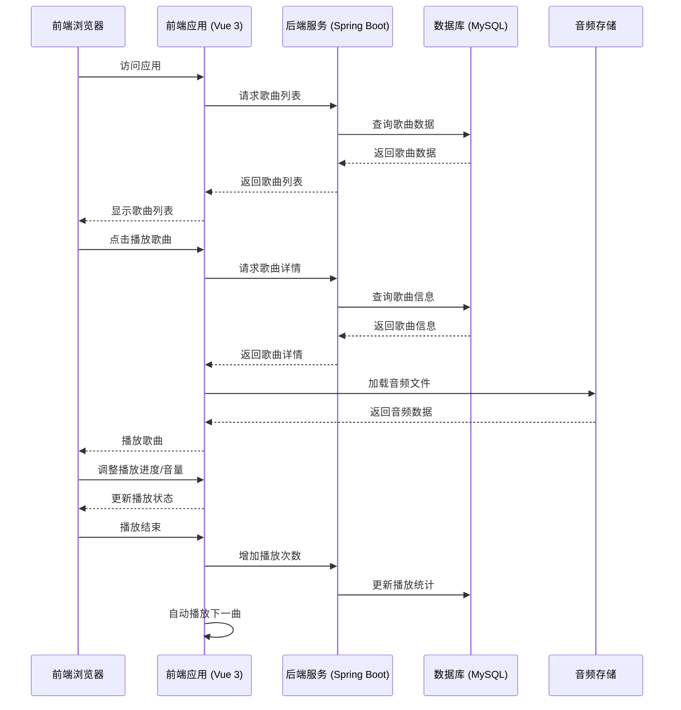
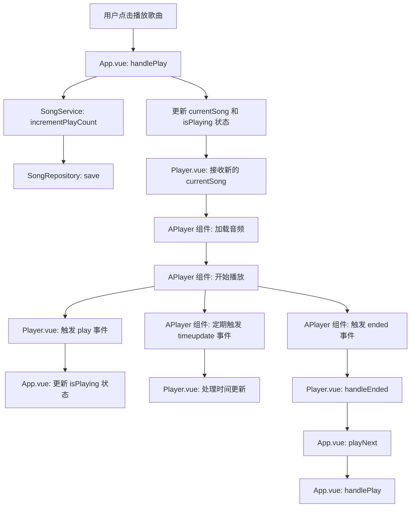
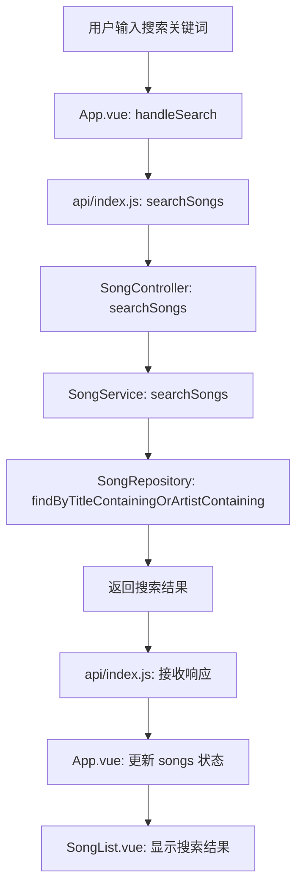
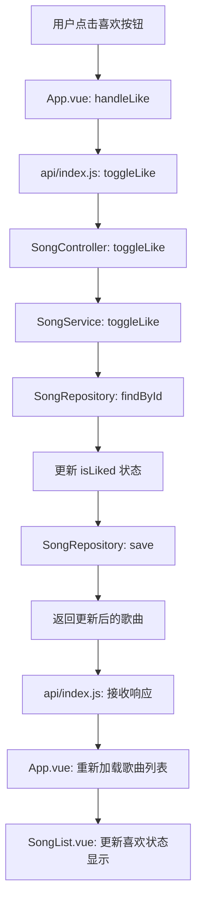

# 音乐播放器项目技术实现方案

## 1. 仓库分析

### 1.1 项目结构分析

通过对当前仓库的分析，项目采用了标准的全栈架构设计，包含前端和后端两个主要模块：

**前端模块 (`frontend/`)**：
- 基于 Vue 3 + Vite 构建的现代前端应用
- 使用 Element Plus 作为 UI 组件库
- 已集成 @moefe/vue-aplayer 第三方播放器组件
- 包含完整的响应式布局，支持移动端适配
- 实现了歌曲列表、播放器控制、搜索等核心功能

**后端模块 (`backend/`)**：
- 基于 Spring Boot 构建的 Java 后端服务
- 提供完整的 RESTful API 接口
- 实现了歌曲管理、播放列表管理、播放统计等功能
- 内置了音频文件存储和管理

**Docker 配置**：
- 提供了完整的 docker-compose.yml 配置
- 支持一键启动整个应用栈
- 包含前端、后端服务的容器化配置

### 1.2 核心功能分析

**已实现功能**：
1. **歌曲播放控制**：播放、暂停、上一曲、下一曲
2. **歌曲管理**：获取全部歌曲、热门歌曲、我喜欢的歌曲
3. **播放列表**：支持多播放列表管理
4. **搜索功能**：支持按关键词搜索歌曲
5. **播放统计**：记录歌曲播放次数
6. **喜欢功能**：支持标记和取消标记喜欢的歌曲
7. **响应式布局**：适配桌面端和移动端

**待优化功能**：
1. **播放器组件**：已使用第三方 @moefe/vue-aplayer 组件，功能完善
2. **进度条**：已集成在播放器组件中，功能正常
3. **UI/UX**：已使用 Element Plus 组件库，界面美观
4. **性能优化**：可进一步优化音频加载和播放性能

## 2. 技术选型

### 2.1 前端技术栈

| 技术 | 版本 | 用途 | 选型理由 |
|------|------|------|----------|
| Vue.js | 3.x | 前端框架 | 轻量级、响应式、生态丰富，适合构建现代 Web 应用 |
| Element Plus | 2.x | UI 组件库 | 提供丰富的组件，支持主题定制，文档完善 |
| Vite | 4.x | 构建工具 | 快速的开发服务器和构建性能，支持热更新 |
| @moefe/vue-aplayer | 2.0.0-beta.5 | 播放器组件 | 功能完善的音乐播放器组件，支持进度条、音量控制等 |
| Axios | - | HTTP 客户端 | 用于前端与后端 API 通信 |

### 2.2 后端技术栈

| 技术 | 版本 | 用途 | 选型理由 |
|------|------|------|----------|
| Spring Boot | 3.x | 后端框架 | 快速开发、自动配置、生态丰富，适合构建 RESTful API |
| Spring Data JPA | - | ORM 框架 | 简化数据库操作，提供对象-关系映射 |
| MySQL | 8.0 | 数据库 | 稳定可靠的关系型数据库，适合存储歌曲和播放列表数据 |
| Maven | 3.9+ | 构建工具 | 管理项目依赖，构建和打包应用 |

### 2.3 容器化技术

| 技术 | 版本 | 用途 | 选型理由 |
|------|------|------|----------|
| Docker | 20.0+ | 容器化平台 | 提供一致的开发和部署环境，简化应用管理 |
| Docker Compose | 2.0+ | 容器编排 | 定义和运行多容器 Docker 应用，支持一键启动整个应用栈 |
| Nginx | 1.20+ | 前端服务器 | 提供静态文件服务和反向代理 |

## 3. 架构设计

### 3.1 整体架构



### 3.2 模块划分

**前端模块**：
1. **核心组件**：
   - Player.vue：播放器组件，负责音频播放控制
   - SongList.vue：歌曲列表组件，显示歌曲列表
   - App.vue：应用主组件，管理全局状态

2. **API 模块**：
   - api/index.js：封装与后端的 HTTP 通信

**后端模块**：
1. **控制器层**：
   - SongController：处理歌曲相关的 API 请求
   - PlaylistController：处理播放列表相关的 API 请求

2. **服务层**：
   - SongService：实现歌曲管理的业务逻辑
   - PlaylistService：实现播放列表管理的业务逻辑

3. **数据访问层**：
   - SongRepository：歌曲数据的数据库访问
   - PlaylistRepository：播放列表数据的数据库访问
   - PlaylistSongRepository：播放列表与歌曲关联数据的数据库访问

4. **模型层**：
   - Song：歌曲实体类
   - Playlist：播放列表实体类
   - PlaylistSong：播放列表与歌曲的关联实体类

### 3.3 关键流程

**歌曲播放流程**：
1. 用户在前端选择歌曲
2. 前端发送播放请求到后端，增加播放次数
3. 前端加载音频文件并开始播放
4. 播放器组件更新播放状态和进度条
5. 播放结束后，前端自动播放下一曲

**搜索流程**：
1. 用户在搜索框输入关键词
2. 前端发送搜索请求到后端
3. 后端查询数据库并返回匹配的歌曲
4. 前端更新歌曲列表显示搜索结果

**喜欢歌曲流程**：
1. 用户点击歌曲的喜欢按钮
2. 前端发送喜欢/取消喜欢请求到后端
3. 后端更新数据库中歌曲的喜欢状态
4. 前端更新歌曲的喜欢状态显示

## 4. 目录结构

### 4.1 前端目录结构

```plaintext
frontend/
├── src/
│   ├── api/             # API 调用封装
│   │   └── index.js     # API 接口定义
│   ├── components/      # Vue 组件
│   │   ├── Player.vue   # 播放器组件
│   │   ├── SongList.vue # 歌曲列表组件
│   │   └── ProgressBar.vue # 进度条组件（已集成到 Player 中）
│   ├── App.vue          # 应用主组件
│   ├── main.js          # 应用入口
│   └── assets/          # 静态资源
├── public/              # 公共静态资源
├── Dockerfile           # 前端 Dockerfile
├── package.json         # 前端依赖配置
├── vite.config.js       # Vite 配置
└── index.html           # HTML 入口文件
```

### 4.2 后端目录结构

```plaintext
backend/
├── src/
│   └── main/
│       ├── java/com/musicplayer/
│       │   ├── controller/        # 控制器
│       │   │   ├── SongController.java
│       │   │   ├── PlaylistController.java
│       │   │   └── ProxyController.java
│       │   ├── dto/               # 数据传输对象
│       │   │   ├── ApiResponse.java
│       │   │   ├── SongDTO.java
│       │   │   └── PlaylistDTO.java
│       │   ├── entity/            # 实体类
│       │   │   ├── Song.java
│       │   │   ├── Playlist.java
│       │   │   └── PlaylistSong.java
│       │   ├── repository/        # 数据访问接口
│       │   │   ├── SongRepository.java
│       │   │   ├── PlaylistRepository.java
│       │   │   └── PlaylistSongRepository.java
│       │   ├── service/           # 业务逻辑
│       │   │   ├── SongService.java
│       │   │   └── PlaylistService.java
│       │   └── MusicPlayerApplication.java # 应用入口
│       └── resources/
│           ├── audio/             # 音频文件存储
│           ├── application.yml    # 应用配置
│           └── init.sql           # 数据库初始化脚本
├── Dockerfile           # 后端 Dockerfile
├── pom.xml              # Maven 依赖配置
└── settings.xml         # Maven 设置
```

## 5. 关键类与函数设计

### 5.1 前端关键组件

#### Player 组件

| 函数/方法 | 功能描述 | 参数 | 返回值 | 所属文件 |
|-----------|----------|------|--------|----------|
| handlePlay | 处理播放事件 | 无 | 无 | frontend/src/components/Player.vue |
| handlePause | 处理暂停事件 | 无 | 无 | frontend/src/components/Player.vue |
| handleEnded | 处理播放结束事件 | 无 | 无 | frontend/src/components/Player.vue |
| handleTimeUpdate | 处理时间更新事件 | data: Object | 无 | frontend/src/components/Player.vue |
| handleVolumeChange | 处理音量变化事件 | data: Number | 无 | frontend/src/components/Player.vue |

#### App 组件

| 函数/方法 | 功能描述 | 参数 | 返回值 | 所属文件 |
|-----------|----------|------|--------|----------|
| loadSongs | 加载歌曲列表 | 无 | Promise<void> | frontend/src/App.vue |
| loadPlaylists | 加载播放列表 | 无 | Promise<void> | frontend/src/App.vue |
| handlePlay | 处理播放歌曲 | song: Object | Promise<void> | frontend/src/App.vue |
| togglePlayPause | 切换播放/暂停状态 | 无 | void | frontend/src/App.vue |
| playNext | 播放下一曲 | 无 | void | frontend/src/App.vue |
| playPrev | 播放上一曲 | 无 | void | frontend/src/App.vue |

### 5.2 后端关键类

#### SongController

| 方法 | 功能描述 | 参数 | 返回值 | 所属文件 |
|------|----------|------|--------|----------|
| getAllSongs | 获取全部歌曲 | 无 | ApiResponse<List<SongDTO>> | backend/src/main/java/com/musicplayer/controller/SongController.java |
| getSongById | 根据 ID 获取歌曲 | id: Long | ApiResponse<SongDTO> | backend/src/main/java/com/musicplayer/controller/SongController.java |
| searchSongs | 搜索歌曲 | keyword: String | ApiResponse<List<SongDTO>> | backend/src/main/java/com/musicplayer/controller/SongController.java |
| getMostPlayedSongs | 获取热门歌曲 | 无 | ApiResponse<List<SongDTO>> | backend/src/main/java/com/musicplayer/controller/SongController.java |
| getLikedSongs | 获取我喜欢的歌曲 | 无 | ApiResponse<List<SongDTO>> | backend/src/main/java/com/musicplayer/controller/SongController.java |
| incrementPlayCount | 增加播放次数 | id: Long | ApiResponse<Void> | backend/src/main/java/com/musicplayer/controller/SongController.java |
| toggleLike | 切换喜欢状态 | id: Long | ApiResponse<SongDTO> | backend/src/main/java/com/musicplayer/controller/SongController.java |

#### SongService

| 方法 | 功能描述 | 参数 | 返回值 | 所属文件 |
|------|----------|------|--------|----------|
| getAllSongs | 获取全部歌曲 | 无 | List<SongDTO> | backend/src/main/java/com/musicplayer/service/SongService.java |
| getSongById | 根据 ID 获取歌曲 | id: Long | SongDTO | backend/src/main/java/com/musicplayer/service/SongService.java |
| searchSongs | 搜索歌曲 | keyword: String | List<SongDTO> | backend/src/main/java/com/musicplayer/service/SongService.java |
| getMostPlayedSongs | 获取热门歌曲 | 无 | List<SongDTO> | backend/src/main/java/com/musicplayer/service/SongService.java |
| getLikedSongs | 获取我喜欢的歌曲 | 无 | List<SongDTO> | backend/src/main/java/com/musicplayer/service/SongService.java |
| incrementPlayCount | 增加播放次数 | id: Long | void | backend/src/main/java/com/musicplayer/service/SongService.java |
| toggleLike | 切换喜欢状态 | id: Long | SongDTO | backend/src/main/java/com/musicplayer/service/SongService.java |

## 6. 数据库与数据结构设计

### 6.1 数据库表结构

**`songs` 表**
| 字段名 | 数据类型 | 约束 | 描述 |
|--------|----------|------|------|
| `id` | `BIGINT` | `PRIMARY KEY AUTO_INCREMENT` | 歌曲 ID |
| `title` | `VARCHAR(255)` | `NOT NULL` | 歌曲标题 |
| `artist` | `VARCHAR(255)` | `NOT NULL` | 艺术家 |
| `album` | `VARCHAR(255)` | | 专辑 |
| `duration` | `INT` | | 时长（秒） |
| `audio_url` | `VARCHAR(512)` | `NOT NULL` | 音频文件 URL |
| `cover_url` | `VARCHAR(512)` | | 封面图片 URL |
| `play_count` | `INT` | `DEFAULT 0` | 播放次数 |
| `is_liked` | `BOOLEAN` | `DEFAULT FALSE` | 是否喜欢 |
| `created_at` | `TIMESTAMP` | `DEFAULT CURRENT_TIMESTAMP` | 创建时间 |
| `updated_at` | `TIMESTAMP` | `DEFAULT CURRENT_TIMESTAMP ON UPDATE CURRENT_TIMESTAMP` | 更新时间 |

**`playlists` 表**
| 字段名 | 数据类型 | 约束 | 描述 |
|--------|----------|------|------|
| `id` | `BIGINT` | `PRIMARY KEY AUTO_INCREMENT` | 播放列表 ID |
| `name` | `VARCHAR(255)` | `NOT NULL` | 播放列表名称 |
| `description` | `TEXT` | | 播放列表描述 |
| `created_at` | `TIMESTAMP` | `DEFAULT CURRENT_TIMESTAMP` | 创建时间 |
| `updated_at` | `TIMESTAMP` | `DEFAULT CURRENT_TIMESTAMP ON UPDATE CURRENT_TIMESTAMP` | 更新时间 |

**`playlist_songs` 表**
| 字段名 | 数据类型 | 约束 | 描述 |
|--------|----------|------|------|
| `id` | `BIGINT` | `PRIMARY KEY AUTO_INCREMENT` | 关联 ID |
| `playlist_id` | `BIGINT` | `NOT NULL, FOREIGN KEY REFERENCES playlists(id)` | 播放列表 ID |
| `song_id` | `BIGINT` | `NOT NULL, FOREIGN KEY REFERENCES songs(id)` | 歌曲 ID |
| `order_index` | `INT` | `DEFAULT 0` | 歌曲在播放列表中的顺序 |
| `created_at` | `TIMESTAMP` | `DEFAULT CURRENT_TIMESTAMP` | 创建时间 |

### 6.2 数据传输对象 (DTOs)

**SongDTO**
```java
public class SongDTO {
    private Long id;
    private String title;
    private String artist;
    private String album;
    private Integer duration;
    private String audioUrl;
    private String coverUrl;
    private Integer playCount;
    private Boolean isLiked;
    // 构造函数、getter、setter 省略
}
```

**PlaylistDTO**
```java
public class PlaylistDTO {
    private Long id;
    private String name;
    private String description;
    private List<SongDTO> songs;
    // 构造函数、getter、setter 省略
}
```

**ApiResponse**
```java
public class ApiResponse<T> {
    private int code;
    private String message;
    private T data;
    // 构造函数、getter、setter 省略
    
    public static <T> ApiResponse<T> success(T data) {
        return new ApiResponse<>(200, "success", data);
    }
}
```

### 6.3 前端数据结构

**歌曲对象**
```javascript
const song = {
  id: 1,
  title: "歌曲标题",
  artist: "艺术家",
  album: "专辑",
  duration: 240, // 秒
  audioUrl: "/api/audio/song1.mp3",
  coverUrl: "/api/cover/song1.jpg",
  playCount: 100,
  isLiked: false
};
```

**播放列表对象**
```javascript
const playlist = {
  id: 1,
  name: "我的播放列表",
  description: "我的收藏",
  songs: [/* 歌曲对象数组 */]
};
```

## 7. API 接口设计

### 7.1 歌曲相关接口

| API 路径 | 方法 | 功能描述 | 请求参数 | 成功响应 (200 OK) | 所属文件 |
|----------|------|----------|----------|-------------------|----------|
| `/api/songs` | `GET` | 获取全部歌曲 | 无 | `{"code": 200, "message": "success", "data": [{歌曲对象数组}]}` | backend/src/main/java/com/musicplayer/controller/SongController.java |
| `/api/songs/{id}` | `GET` | 根据 ID 获取歌曲 | `id` (路径参数) | `{"code": 200, "message": "success", "data": {歌曲对象}}` | backend/src/main/java/com/musicplayer/controller/SongController.java |
| `/api/songs/search` | `GET` | 搜索歌曲 | `keyword` (查询参数) | `{"code": 200, "message": "success", "data": [{歌曲对象数组}]}` | backend/src/main/java/com/musicplayer/controller/SongController.java |
| `/api/songs/most-played` | `GET` | 获取热门歌曲 | 无 | `{"code": 200, "message": "success", "data": [{歌曲对象数组}]}` | backend/src/main/java/com/musicplayer/controller/SongController.java |
| `/api/songs/liked` | `GET` | 获取我喜欢的歌曲 | 无 | `{"code": 200, "message": "success", "data": [{歌曲对象数组}]}` | backend/src/main/java/com/musicplayer/controller/SongController.java |
| `/api/songs/{id}/play` | `POST` | 增加播放次数 | `id` (路径参数) | `{"code": 200, "message": "success", "data": null}` | backend/src/main/java/com/musicplayer/controller/SongController.java |
| `/api/songs/{id}/like` | `POST` | 切换喜欢状态 | `id` (路径参数) | `{"code": 200, "message": "success", "data": {歌曲对象}}` | backend/src/main/java/com/musicplayer/controller/SongController.java |

### 7.2 播放列表相关接口

| API 路径 | 方法 | 功能描述 | 请求参数 | 成功响应 (200 OK) | 所属文件 |
|----------|------|----------|----------|-------------------|----------|
| `/api/playlists` | `GET` | 获取全部播放列表 | 无 | `{"code": 200, "message": "success", "data": [{播放列表对象数组}]}` | backend/src/main/java/com/musicplayer/controller/PlaylistController.java |
| `/api/playlists/{id}` | `GET` | 根据 ID 获取播放列表 | `id` (路径参数) | `{"code": 200, "message": "success", "data": {播放列表对象}}` | backend/src/main/java/com/musicplayer/controller/PlaylistController.java |
| `/api/playlists` | `POST` | 创建播放列表 | `{name: "播放列表名称", description: "描述"}` (请求体) | `{"code": 200, "message": "success", "data": {播放列表对象}}` | backend/src/main/java/com/musicplayer/controller/PlaylistController.java |
| `/api/playlists/{id}` | `PUT` | 更新播放列表 | `id` (路径参数), `{name: "新名称", description: "新描述"}` (请求体) | `{"code": 200, "message": "success", "data": {播放列表对象}}` | backend/src/main/java/com/musicplayer/controller/PlaylistController.java |
| `/api/playlists/{id}` | `DELETE` | 删除播放列表 | `id` (路径参数) | `{"code": 200, "message": "success", "data": null}` | backend/src/main/java/com/musicplayer/controller/PlaylistController.java |
| `/api/playlists/{id}/songs` | `POST` | 向播放列表添加歌曲 | `id` (路径参数), `{songId: 1}` (请求体) | `{"code": 200, "message": "success", "data": {播放列表对象}}` | backend/src/main/java/com/musicplayer/controller/PlaylistController.java |
| `/api/playlists/{id}/songs/{songId}` | `DELETE` | 从播放列表移除歌曲 | `id` (路径参数), `songId` (路径参数) | `{"code": 200, "message": "success", "data": {播放列表对象}}` | backend/src/main/java/com/musicplayer/controller/PlaylistController.java |

## 8. 主业务流程与调用链

### 8.1 歌曲播放流程



**调用链**：
- 前端：`App.vue:handlePlay` → `Player.vue: 播放控制` → `APlayer 组件: 播放音频`
- 后端：`SongController:incrementPlayCount` → `SongService:incrementPlayCount` → `SongRepository:save`

### 8.2 搜索歌曲流程



**调用链**：
- 前端：`App.vue:handleSearch` → `api/index.js:searchSongs` → `更新 songs 状态` → `SongList.vue: 显示结果`
- 后端：`SongController:searchSongs` → `SongService:searchSongs` → `SongRepository:findByTitleContainingOrArtistContaining`

### 8.3 切换喜欢状态流程



**调用链**：
- 前端：`App.vue:handleLike` → `api/index.js:toggleLike` → `重新加载歌曲列表` → `SongList.vue: 更新显示`
- 后端：`SongController:toggleLike` → `SongService:toggleLike` → `SongRepository:findById` → `SongRepository:save`

## 9. 部署与集成方案

### 9.1 Docker 部署

**docker-compose.yml 配置**：

```yaml
version: '3.8'

services:
  backend:
    build: ./backend
    ports:
      - "8000:8000"
    volumes:
      - ./backend/src/main/resources/audio:/app/src/main/resources/audio
    environment:
      - SPRING_DATASOURCE_URL=jdbc:mysql://db:3306/musicplayer
      - SPRING_DATASOURCE_USERNAME=root
      - SPRING_DATASOURCE_PASSWORD=root
    depends_on:
      - db

  frontend:
    build: ./frontend
    ports:
      - "3000:80"
    depends_on:
      - backend

  db:
    image: mysql:8.0
    ports:
      - "3306:3306"
    volumes:
      - mysql-data:/var/lib/mysql
      - ./backend/src/main/resources/init.sql:/docker-entrypoint-initdb.d/init.sql
    environment:
      - MYSQL_ROOT_PASSWORD=root
      - MYSQL_DATABASE=musicplayer

volumes:
  mysql-data:
```

### 9.2 前端构建与部署

**Dockerfile (前端)**：

```dockerfile
# 构建阶段
FROM node:20-alpine AS builder
WORKDIR /app
COPY package*.json ./
RUN npm config set registry https://registry.npmmirror.com
RUN npm ci
COPY . .
RUN npm run build

# 生产阶段
FROM nginx:alpine
COPY --from=builder /app/dist /usr/share/nginx/html
COPY nginx.conf /etc/nginx/conf.d/default.conf
EXPOSE 80
CMD ["nginx", "-g", "daemon off;"]
```

### 9.3 后端构建与部署

**Dockerfile (后端)**：

```dockerfile
FROM maven:3.9-eclipse-temurin-17 AS build
WORKDIR /app
COPY settings.xml /usr/share/maven/ref/settings.xml
COPY pom.xml .
RUN mvn -s /usr/share/maven/ref/settings.xml dependency:go-offline
COPY src ./src
RUN mvn -s /usr/share/maven/ref/settings.xml package -DskipTests

FROM eclipse-temurin:17-jre
WORKDIR /app
COPY --from=build /app/target/*.jar app.jar
EXPOSE 8000
ENTRYPOINT ["java", "-jar", "app.jar"]
```

### 9.4 启动流程

1. 确保 Docker Desktop 已启动
2. 在项目根目录执行：`docker-compose up --build`
3. 等待容器启动完成（约 1-3 分钟）
4. 访问前端应用：http://localhost:3000
5. 后端 API 地址：http://localhost:8000/api

## 10. 代码安全性

### 10.1 前端安全

1. **输入验证**：
   - 对用户输入的搜索关键词进行验证，防止注入攻击
   - 使用 Element Plus 的表单验证功能确保输入合法性

2. **API 调用安全**：
   - 使用 Axios 进行 HTTP 调用，设置合理的超时和错误处理
   - 避免在前端存储敏感信息

3. **XSS 防护**：
   - 使用 Vue 的模板系统自动转义 HTML 内容
   - 避免使用 `v-html` 指令处理用户输入的内容

4. **CSRF 防护**：
   - 后端实现 CSRF 令牌验证
   - 前端在请求中包含 CSRF 令牌

### 10.2 后端安全

1. **SQL 注入防护**：
   - 使用 Spring Data JPA 的参数化查询，避免拼接 SQL 语句
   - 对用户输入的搜索关键词进行安全处理

2. **认证与授权**：
   - 实现基于 JWT 的认证机制
   - 对敏感操作进行权限控制

3. **CORS 配置**：
   - 在后端设置合理的 CORS 策略，允许前端跨域请求
   - 使用 `@CrossOrigin` 注解或全局 CORS 配置

4. **错误处理**：
   - 实现统一的错误处理机制
   - 避免在错误响应中泄露敏感信息

5. **资源保护**：
   - 对音频文件的访问进行适当的权限控制
   - 实现文件大小限制，防止恶意上传大文件

### 10.3 Docker 安全

1. **镜像安全**：
   - 使用官方的 Docker 镜像
   - 定期更新镜像版本，修复安全漏洞

2. **容器安全**：
   - 为容器设置合理的资源限制
   - 避免在容器中以 root 用户运行应用

3. **网络安全**：
   - 使用 Docker 网络隔离服务
   - 避免暴露不必要的端口

4. **数据安全**：
   - 使用 Docker Volume 存储数据库数据
   - 对敏感配置使用环境变量，避免硬编码

## 11. 总结与亮点回顾

### 11.1 项目亮点

1. **现代技术栈**：
   - 前端使用 Vue 3 + Element Plus + Vite，构建现代化的响应式界面
   - 后端使用 Spring Boot + JPA，提供高效的 RESTful API
   - 完整的 Docker 容器化部署方案

2. **用户体验**：
   - 响应式设计，适配桌面端和移动端
   - 使用 @moefe/vue-aplayer 提供专业的音乐播放体验
   - 流畅的播放控制和进度条管理

3. **功能完整**：
   - 支持歌曲播放、暂停、上一曲、下一曲
   - 支持歌曲搜索、分类（热门、喜欢）
   - 支持播放列表管理
   - 支持播放统计和喜欢功能

4. **架构合理**：
   - 前后端分离架构，职责清晰
   - 模块化设计，易于扩展和维护
   - 完善的 API 接口设计

5. **性能优化**：
   - 使用 Vite 构建工具，提升开发和构建速度
   - 合理的数据库索引设计，优化查询性能
   - 音频文件的高效加载和缓存策略

### 11.2 未来扩展建议

1. **功能扩展**：
   - 添加用户系统，支持多用户
   - 增加歌曲上传功能
   - 实现歌词显示功能
   - 添加歌曲评论和分享功能

2. **性能优化**：
   - 实现音频文件的按需加载
   - 添加歌曲缓存机制
   - 优化数据库查询性能

3. **安全性增强**：
   - 实现更完善的认证和授权机制
   - 添加 API 请求限流
   - 加强文件上传的安全检查

4. **用户体验提升**：
   - 添加歌曲推荐功能
   - 实现个性化播放列表
   - 优化移动端体验

5. **部署优化**：
   - 实现 CI/CD 流水线
   - 支持 Kubernetes 部署
   - 添加监控和日志系统

### 11.3 结论

本项目是一个功能完整、架构合理、用户体验良好的音乐播放器应用。通过使用现代的技术栈和最佳实践，实现了一个专业级的音乐播放系统。项目支持 Docker 容器化部署，可一键启动整个应用栈，方便开发和生产环境使用。

未来可以通过持续的功能扩展和性能优化，进一步提升应用的价值和用户体验，使其成为一个更加完善的音乐播放平台。